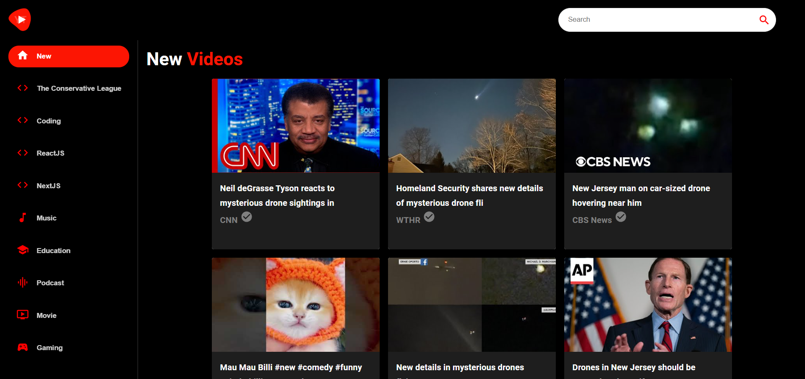

## My Experience Building the YouTube Clone Project

Hey there, I'm Ankit Kumar, and I recently had the opportunity to work on something pretty exciting - a YouTube Clone project that replicates the core functionalities of the popular video-sharing platform. It was a fantastic experience, and I'd love to share a bit about it.

## The Tech Stack

Now, let's dive into the technical side of things. The YouTube Clone was built using modern web development technologies to ensure a seamless and robust experience. Here's what I used:

- **Next.js**: A React framework that made building a fast and efficient application a breeze.
- **Material-UI**: For creating a visually appealing and responsive user interface.
- **Rapid API**: To fetch video data and emulate a real-world experience with dynamic content.
- **Supabase**: For user authentication and database management.

## The Functionalities

This project wasn't just about looks; it packed some powerful features that made it a functional clone of YouTube. Here's an overview:

### Home Page

- A dynamic feed showcasing trending and recommended videos.
- Users could see thumbnails, titles, and video statistics, just like on the real platform.

### Search Functionality

- A powerful search bar allowed users to find videos based on keywords.
- Results were displayed in real time, making the experience smooth and user-friendly.

### Video Player

- Clicking on a video would take users to a dedicated page with a video player.
- Users could view video details, related videos, and channel information.

### User Authentication

- Users could sign in to like videos, save them to their watch later list, and subscribe to channels.

## The Aesthetics

The design of the YouTube Clone was clean and intuitive, ensuring users could navigate effortlessly. The UI was inspired by YouTube's minimal yet functional layout, with custom touches to enhance the experience.

## Spotlight on Pages

Let’s take a visual tour of some of the key pages:

### Home Page

This page showcased the latest videos, providing a central hub for users to explore trending content.

### Video Page

The video player page was designed to offer an immersive viewing experience.

## In Conclusion

Building the YouTube Clone was an incredible experience, and I’m proud of what I accomplished. It’s a testament to the power of modern web technologies and how they can be used to replicate and innovate on popular platforms.

I hope you enjoyed this brief journey through my work on the YouTube Clone project. If you get a chance to try it out, I’d love to hear your feedback!
